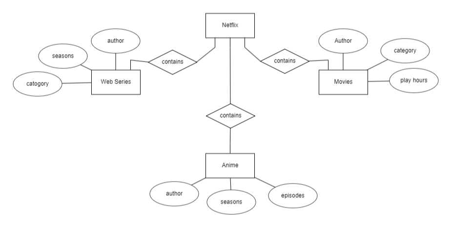

## DBMS :
     A System of data structure used to store and organize data.
## Component :
 ```
    data
    query language
    hardware
    software
```
## Architecture :
    Single-tier : 
     client and server are in same system.
    Two-tier : 
     when a client want to use a DB if he uses a application to access it then it is two-tier.
    Three-tier : 
     For a three-tier , the client sends a query through application layer which passes to the admin who controls DB and authorize data to make change in DB.
     It provides security for the data.
## Data : 
    It is a raw input.                
## RDBMS :
    Using tables to store data in DB.Stuctured way of storing data.
## Types of DB
```
    Distributed 
    Centralized
    Relational
    Graph
    NoSQL
    Cloud
``` 
## Distributed :
    When a DB is distributed amoung users it is distributed DB
    it contains multiple databases

## Centralized :
    When multiple users access a  centralized DB. it contain multiple tables within a database

## Graph :
    It is a many to many relationship database

## NoSQL :
    It Stores unstructed data and also strutured data.

## Cloud :
    It Stores data in clound Storages like AWS , Azure , Google cloud.

## Components of DBMS :
    Configuring authentication and authorization.

## Metadata:    
    Stores authentication and authorizaton logs of every users.

## Model Data :
    ER : it is a pictorial way of showing a databases through sql(Entity,relationships).
    Semi-Structured : When we dont know what kind of data is going to be stored in DB we use semi-structured database.
    object-oriented : it follows oops concept to store data,it is mainly used for unstructed format of data.

## Entity Relationship :
    entity - rectagle
    attributes - oval
    relationship - rhombus
    
    
## Attributes :
    key - unique attribute
    composite - contains multiple attributes within it
    multiple - it is a multi valued attributes
    derived - it depents on another attributes

## Entity :
    Strong - it do not depend on other entity   
    Weak -  it depends on other entity 

## Relationship :
```
    one to one
    one to many
    many to one 
    many to many
```   
## sql query commands :
    DDL-Data definition lang
    DML-Data manupulation lang
    TCL-transaction control lang
    DCL-Data control lang
    DQL-Data query lang

### DDL
```
    create
    Alter   
    Drop
    Truncate
```
### DML
```
    insert
    update 
    delete
```
### DCL
```
    grant
    revoke
```    

### TCL
```
    commit
    rollback
    save point
```

### DQL
```
    select
```    
## server :
    A server is a computer program or device that provides a service to another computer program and its user, also known as the client
    